# Feature Extraction For Physical Activity Recognition

This project focuses mainly on the feature extraction module, assessing various types of normalization, analyzing the effectiveness of each sensor included in inertial measuring units. The main research was conducted using a publicly available data kit, called the REALDISP Activity Recognition data set, which contains recordings in three scenarios of 17 individuals performing 33 different activities. This data was collected using inertial units connected and anchored on the various parts of a human body, with nine inertial units giving measurement into three-dimensional units throughout the process. Two key areas of the HAR analytics process 
are present: The first one is an extractor that gathers the most important data from inertial signals. The second one is an algorithm that Predicts the physical activity categories. The data analysis is composed of two main parts. One is called model selection, which is to select the right combination of learning methods and adjusting the hyper-parameters of the model for better results. The second part is to estimate the performance of the final model‘s output. 

## Table of Contents
* [Feature Extraction For Physical Activity Recognition](#feature-extraction-for-physical-activity-recognition)
* [2-Background](#2-background)
* [3-System Design](#3-system-design)
* [4-Feature extraction](#4-feature-extraction)
  * [4.1-Time domain features](#41-time-domain-features)
  * [4.2-Frequency domain features](#42-frequency-domain-features)
  * [4.3-Wavelet (Time-frequency) domain features](#43-wavelet-time-frequency-domain-features)
* [5-Machine learning Model](#5-machine-learning-model)
  * [5.1-Random Forest Model](#51-random-forest-model)
* [6-Experiment Results and Discussion](#6-experiment-results-and-discussion)
  * [6.1-REALDISP Datasets](#61-realdisp-datasets)
  * [6.2-Evaluation Methods](#62-evaluation-methods)
  * [6.3-Data Analysis and results](#63-data-analysis-and-results)
    * [6.3.1-Evaluation method](#631-evaluation-method)
    * [6.3.2-Type of sensors](#632-type-of-sensors)
    * [6.3.3-Type of features](#633-type-of-features)
* [7-Normalization methods](#7-normalization-methods)
* [8-Results and Discussion](#8-results-and-discussion)
* [9-Credits](#9-credits)

## 2-Background
The process of human activity recognition involves two main categories: one is the Simulation of Machine learning algorithms and the second is the implementation of sensors for physical activity measurement. Human Activity Recognition follows three main phases: 
  1. Data collection from 9 inertial measurement units 
  2. Data preprocessing and extraction, and 
  3. Machine learning 

## 3-System Design

The system design is composed of two parts

  1. feature extraction module and 
  2. a classifier module for the machine-learning algorithm. 
  
Nine inertial measuring units for measuring the inertial signals and each unit is composed of 
   - an accelerometer(AC), 
   - a gyroscope(GY), 
   - a magnetometer(MA) and, 
   - a quaternion(QU) sensor. 
  

## 4-Feature extraction
### 4.1-Time domain features

From each window and for each x, y, and z-axis the features extracted is composed of 12 time-domain features. This extracted feature-vector is a signal representation composed of statistical characteristics, such as mean, variance, standard deviation, median, the maximum and minimum value, root mean square value, as well as the signal magnitude area.

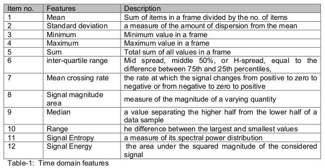

### 4.2-Frequency domain features

At the frequency domain, six types of features were extracted from each window for each x, y, and z-axis. The Fast Fourier Transform is the method used to transform the data from the time domain to the frequency domain.

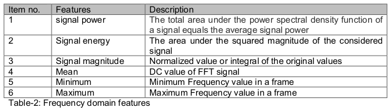

### 4.3-Wavelet (Time-frequency) domain features

The Time-frequency domain is also known as the wavelet transform where twelve relevant features were extracted from each window for each axis x, y, and z-axis. In the beginning, a Discrete Wavelet Transform is used to convert data to the time-frequency domain from the time domain input signal. The Discrete wavelet domain contains a group of coefficients that are further classified into two groups one is approximation coefficients and the second group is the details coefficients. The next step was to select, the most accurate three sets of features.

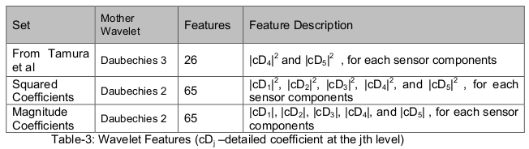

## 5-Machine learning Model

A model was selected for training the feature vectors with their corresponding labels and classifies one of the learning activities. According to model selections, Decision tree, Naïve Bayes, Nearest centroid classifier, K-Nearest Neighbors, and ensemble classifiers such as Random Forest were used in the classification of HAR, and the Random Forest was the best performing
algorithm. The window frame size and the feature vector extraction in the feature extraction process are hyperparameters and, they are adjusted by trials and error to get the best performance.

### 5.1-Random Forest Model

The first step was to upload all data set from a CSV file and adding each class label at the end of each vector. Next, the training data was divided randomly into 40 subsets and a Decision Tree is created for each subset. All the feature vectors are part of a unique node at the beginning. Then each node is divided by all features and different thresholds. The best division
is selected by objective function entropic gain. When the best division improves the entropy of nodes over a threshold, the node is divided, otherwise, it is not divided. Then repeat from the beginning until a maximum number of iterations are 40 or if all nodes cannot be further divided. Every new entry for classification from the test visits all the trees so that the final classification is completed. The feature vector selects the final node and class distribution for every decision tree in the model.
Then the combined class distributions are taken from all the trees and generate the feature vector for class prediction. Hence, the classification results are weighted average for all terminal nodes that have been visited. 

## 6-Experiment Results and Discussion
### 6.1-REALDISP Datasets 

The dataset used is available in [this website](https://archive.ics.uci.edu/ml/datasets/REALDISP+Activity+Recognition+Dataset).

The dataset consists of data from 17 subjects with diverse profiles attaching 9 Xsens (IMUs) on various parts of the organism. Subjects performed 33 fitness activities ranging from warm-up to fitness exercises in an out of lab environment. Each sensor provides the tri-directional acceleration, gyroscope, and magnetic field measurements, as well as, orientation estimates in quaternion format (4D).

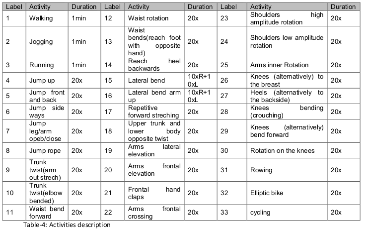

### 6.2-Evaluation Methods

Two methods for evaluating the system performance 
 1. A 10-fold random partitioning cross-validation assessment, which involves splitting the whole database (with all subject data) randomly into 10 parts, followed by one subset for the testing. The nine others for training in the light of the round-robin strategy, the final cross-validation result is the mean for the 10 experiments.

 2. The second method subject-wise cross-validation, all data from the same user is considered for the test, and the data from the remaining subjects are considered for training. As we have 17 subjects in the database this experiment is repeated 17 times. The final test result for all 17 sub-experiments weighted by the number of samples in each test data is the mean accuracy and the F-measure.

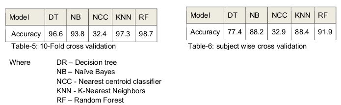

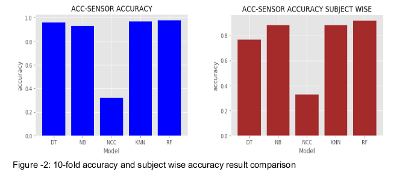

### 6.3-Data Analysis and results

In this section, the first procedure was to select a frame design by implementing a trial and error. Then evaluate two things one is the selection of sensors and the second is the type of features for the best performance using machine learning algorithms.

#### 6.3.1-Evaluation method

In these experiments, the setup is ideal placement, zero activity discarded, and time-based features. The test results are shown in Table-7. From the findings, we can clearly see that our result provided by the random distribution method is much better than the subject-wise results.

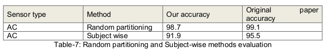

#### 6.3.2-Type of sensors

In this section, evaluated the system performance on all kinds of sensors in the time domain. The results of showed that the gyroscope scores 92.3 percent which is the highest performance while the quaternion gives the lowest performance 72.9 percent.

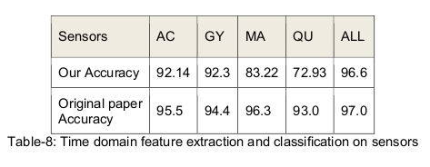

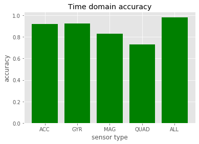

#### 6.3.3-Type of features

The results of the time domain characteristics always exceed the frequency domain characteristics and their combination; therefore only the time-based characteristics are considered in the remaining experiments. In conclusion, the best system configuration is present on the time domain features using a gyroscope, and achieved even higher system accuracy equal to 96.6 percent through all sensors.

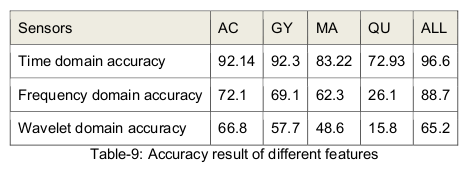

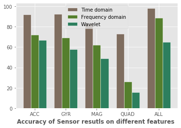

## 7-Normalization methods

The normalization methods are mean removal, Z-Score, Histogram equalization, 0-1 mapping, Vector normalization, and Vector normalization with mean normalization.

1-Mean Removal

Centering the dataset at zero by removing the mean is very important in removing bias from the data features. The mean removal technique simply centers our dataset by removing the average value of each feature.

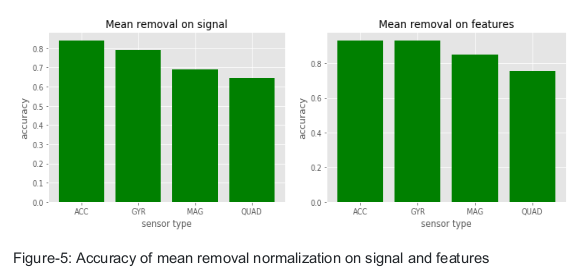

2-Z-score

The dataset was normalized by discarding the mean and scaling to unit variance. Implementing a z-score on the extracted features
shows high performance on almost all the sensor data. The accelerometer accuracy is the highest accuracy (92.7 %) from all sensor data in z-score normalization.

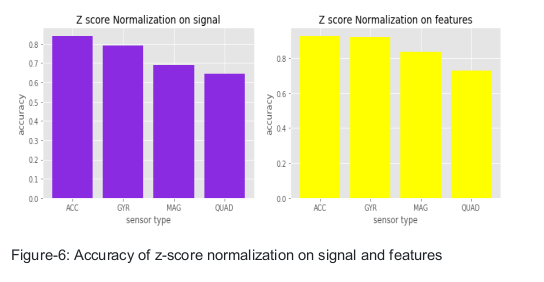

3-Histogram equalization

The histogram equalization using greyscale level normalization shows good performance at the feature side than the signal side.

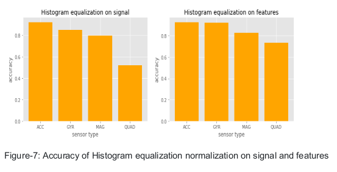

4-Zero-one mapping

The scaling of features from a certain minimum to a certain maximum value is an alternative standardization method, often from zero to one that is every feature’s maximum absolute value is scaled to unit size.

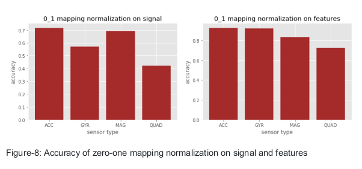

5-Vector normalization

This method involves setting the values in the feature vector into a common scale. Each value in the feature will be adjusted so that the overall sum of the values is equal to one.

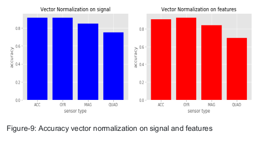

6-Vector normalization and mean removal

Applying vector normalization followed by mean removal has similar results to vector normalization without mean removal on the feature sets. However, the performance of each sensor decreases by almost 10 % on the signal dataset when vector normalization is followed by mean removal.

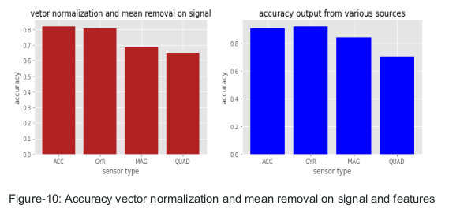

7-All sensors Normalization result

Performing vector normalization on signal gives better performance than performing normalization on the feature side. The result shows that all types of normalization on features are greater than 96 %, however, the vector normalization on the signal is the best of all normalization in the experiment (97.57%). The result of this normalization is greater than the result of the original paper (97%). The difference is 0.57% which is greater than the confidence interval (0.5%).The vector normalization was the highest
performing normalization. Hence the best combination was to use vector normalization on the signal for the rest of the experiment.

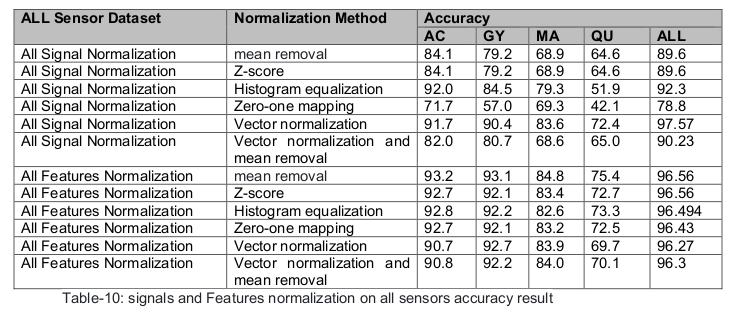

## 8-Results and Discussion

1-Ideal placement

The final result using ideal placement is greater than the original paper (baseline). From Table-11 the ideal placement result in this paper is 97.57 percent and the original paper is 97 percent. The difference is 0.57% which is greater than the confidence interval (0.5%).

2-Self and Mutual placement

The accuracy of the remaining two sensor placement was implemented to the self and mutual placement and the result was slightly lower than the original paper. The ideal placement and self place are the highest results 91.7 and 85.6 respectively.

## 9-Credits

 - Banos O, Toth MA, Damas M, Pomares H, Rojas I (2014) Dealing with the efects of sensor displacement in wearable activity recognition. Sensors 14:9995–10023.
 - Banos O, Toth MA, Damas M, Pomares H, Rojas I (2014) Dealing with the efects of sensor displacement in wearable activity recognition. Sensors 14:9995–10023 
 - Cox DR, Hinkley DV (1974) Theoretical statistics. Chapman & Hall, London

